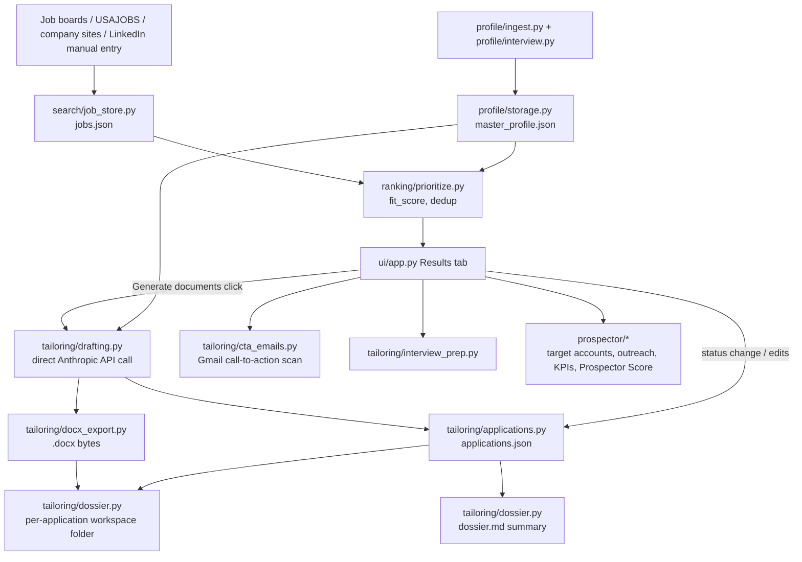

# Panga codemap

Read this first, before grepping/exploring `src/` from scratch. It's a
navigation aid, not documentation of behavior - for the "why" behind a
feature, see `docs/backlog-log.md` §13 (backlog log, most
recent entries at the bottom) or the module's own docstring.

## Data flow, top to bottom

## Module map (one line each)

**search/** - finding and storing jobs
- `job_store.py` - the `jobs` table (JSON, encrypted). `load_jobs`/`save_jobs`/`update_job_score`/`update_job_address`/`flag_employer_attribution_uncertain` (caution flag when a source's stated employer looks wrong vs. the posting's own text - see the panga-daily-job-search SKILL.md's STEP 2 for the live check that calls it, Indeed-specific so far)/`flag_freshness_check_downgraded` (batch caution flag set when a company is removed from `job_sources.yaml` - see `ranking/prioritize.py`'s `find_freshness_downgrade_targets()` for how the affected job set is computed, and `ui/app.py`'s "Save job-board sources" handler for where it's triggered).
- `usajobs.py`, `boards.py`, `industry_boards.py`, `company_sites.py` - one source-channel each, all normalize into the same job shape. `company_sites.py` covers Workday/SmartRecruiters/Greenhouse/Lever ATS platforms. `boards.py` is mixed: ZipRecruiter/Indeed are MCP-only (normalize functions, no direct fetch); Dice, Built In, and SimplyHired are direct scrapes (`fetch_dice_jobs()`/`fetch_built_in_jobs()`/`fetch_simplyhired_jobs()`, all confirmed server-rendered HTML, no MCP needed - see the module docstring before assuming all 3 original sources need the MCP connector). The 3 direct-scrape boards search PER target-role keyword (not fetch-everything) - see the module docstring's BROAD-SCOPE UPDATE for why that matters at broad-board scale.
- `job_sources.py` - user-managed ATS company list (`config/job_sources.yaml`, plain YAML, file-locked) backing `company_sites.py` - editable from the Settings tab's "Job-board sources" section instead of a hardcoded list in `scripts/run_search.py`. `freshness_check.py` also derives its per-company closed-posting checks from this store. `load_job_sources()` silently drops malformed entries (missing a required field) and duplicate `company_name`s (checked globally across all 4 platforms, not just within one) - the backstop layer protecting every caller that indexes fields directly; the Settings tab's "Save" button is the primary defense, validating and refusing to save first.
- `aggregators.py` - Adzuna aggregator API client (`fetch_adzuna_jobs()`), credential-gated via .env same as `usajobs.py`, plus a persisted daily call-budget guard (`data/adzuna_call_budget.yaml`, file-locked) since the free tier's daily cap is real and shared across every (role, country) search combination. Countries to search are user-picked in the Settings tab, stored in `settings.aggregator_countries`.
- `source_activity.py` (2026-08-07) - tracks per-source "how many new jobs did this run add" history (`data/source_activity.json`, file-locked) so a whole board/company going quietly stale can be caught automatically (Rigzone's own volume drop was the live example that motivated this), not just an individual posting closing (that's `freshness_check.py`'s job). `is_source_stale()` is human-surfaced (a Settings-tab hint) not auto-acted-on. `scripts/run_search.py` calls `record_run_result()` after every source's fetch, including per-company inside `search_company_sites()`/`search_ats_boards()`.

**ranking/**
- `prioritize.py` - sorts/dedupes the combined job list (fit_score, role-weight, cross-source dedup via `dedupe_across_sources()`). `find_freshness_downgrade_targets()` reuses that same matching to find which stored jobs (a removed company's own postings + their known cross-source duplicates) should get an explicit freshness-check-confidence downgrade when the company leaves `job_sources.yaml`.

**profile/** - the candidate's own data
- `storage.py` - `load_profile`/master_profile.json, encrypted.
- `ingest.py` - parses uploaded resume/context .docx/.pdf into the master profile.
- `interview.py` - gap-probing interview engine; `save_answer()` feeds `gap_interview_answers`, also the landing spot for drafting's clarifying-question answers.

**tailoring/** - everything about one application
- `drafting.py` - the ONE direct-Anthropic-API module (deliberate exception to "Python orchestrates, Claude reasons live"). `generate_documents()` drafts resume/cover_letter/exec_bio/leadership_summary/apply_answers; resume also gets ATS score + clarifying questions + suggested strategy tag; cover letter triggers a one-time web-search company-address lookup (cached on the job record).
- `applications.py` - the `applications` table (JSON, encrypted). `upsert_application`, status suggestions, edit-review gate (`needs_edit_review`/`record_document_edit_review`).
- `dossier.py` - per-application workspace folder under `data/applications/dossiers/{org-title-slug}-{hash}/` - plain (unencrypted) `.docx` files named `Name_DocType_Role_Company.docx` plus `dossier.md`. `sync_workspace_documents()` writes them on (re)generate with edit-preserving backups; `check_for_edits()` diffs Zahir's hand-edited copy back against the stored draft text.
- `docx_export.py` - plain text -> styled `.docx` bytes (resume style vs. cover-letter style are different renderers).
- `interview_prep.py` - interview rounds/interviewer research store, PLUS `generate_prep()` (native-packaging branch) - direct-API web-research + structuring, replacing the old live-Claude-Code research/drafting step.
- `cta_emails.py` - Gmail call-to-action store (offers/interview requests/rejections/etc., populated by the external `panga-gmail-cta-scan` scheduled task, not by this app).
- `tailor.py` - older/lower-level JD+profile drafting helper (mostly superseded by `drafting.py`'s one-click flow - check before extending, it may be legacy).

**prospector/** - proactive search (target accounts, outreach, self-scoring)
- `target_accounts.py`, `outreach.py`, `kpis.py`, `learn_engine.py`, `rejection_diagnosis.py` - the KPI/self-learning layer.
- `prospector_score.py` - Coverage/Activity/Outcome summary gathering PLUS `compute_prospector_score()`, a direct-Anthropic-API call (same deliberate exception as `tailoring/drafting.py`) that computes the actual score - no more "prepare data, go ask Claude Code" two-step.
- `rejection_diagnosis.py` (native-packaging branch) - `gather_diagnosis_input()` (mechanical) PLUS `diagnose()`, direct-API - same "no more ask Claude Code" conversion.
- `learn_engine.py` (native-packaging branch) - `gather_learn_engine_input()` (mechanical) PLUS `analyze()`, direct-API, same conversion.
- `clinical_trials.py`, `commercial_hiring.py`, `funding_filings.py`, `company_filters.py` - signal sources that feed target_accounts; `clinical_trials.py` filters out trials with a stale (2+ year) primary completion.
- `regulatory_filings.py` - DEPRECATED as a target-account signal source (2026-07-31) - "already approved" pointed the wrong direction for prospecting; read its module docstring before reusing.
- `company_lookup.py` - one-time web-search lookup of a target account's real company website (`lookup_company_website()`), cached via `target_accounts.set_website()`.

**src/api_cost.py** - `estimate_response_cost(response, model)`, real dollar cost of one direct-API call from its actual `usage` + web-search count. Reusable across every direct-API call site (drafting.py, company_lookup.py, prospector_score.py); use it instead of re-deriving token math per module.

**src/llm_client.py** (native-packaging branch) - shared direct-Anthropic-API plumbing (client setup, streamed structured-output calls, web-search calls, error handling) factored out of drafting.py/prospector_score.py/company_lookup.py, which now just call into it; `DEFAULT_MODEL`/exceptions re-exported from `tailoring.drafting` under their old names so no other import path changed.

**src/gmail_client.py** (native-packaging branch) - official Gmail API + OAuth (native-packaging Phase 1), replacing the Claude Code Gmail MCP connector: `search_threads`/`get_thread`/`list_labels`/`create_label`/`ensure_label`/`label_thread`/`unlabel_thread`/`create_draft`/`list_drafts`. One-time OAuth client setup needed - see its `get_credentials()` docstring. PLUS `find_downloaded_credentials()`/`install_credentials_from_path()`/`install_credentials_from_bytes()` - support functions for the Settings-tab setup wizard (`ui/app.py`'s "Gmail connection" section) that deep-links each Google Cloud Console step and auto-detects the downloaded client-secret JSON in Downloads.

**src/notifications.py** (native-packaging branch) - `send_notification()`, a Windows balloon-tip notification (System.Windows.Forms via PowerShell) replacing Claude Code's PushNotification tool for the standalone scheduled scripts.

**src/security/file_lock.py** (native-packaging branch) - `locked(name)`, a cross-process advisory lock for a JSON store's whole read-modify-write critical section. Added because this branch's standalone scheduled scripts are the first *unattended* writers to jobs.json/applications.json/cta_emails.json running alongside the Streamlit app - wrapped around job_store.py's and applications.py's and cta_emails.py's write functions.

**scripts/** (native-packaging branch) - standalone replacements for the 3 Claude Code scheduled tasks, run via native Windows Task Scheduler instead (see `docs/native-packaging-task-scheduler.md`): `run_search.py` (daily job search + direct-API fit scoring), `gmail_cta_scan.py` (Gmail classification via gmail_client.py + tailoring/cta_reasoning.py), `cta_fulfillment.py` (archive/draft fulfillment + reconciliation). `install_scheduled_tasks.ps1`/`uninstall_scheduled_tasks.ps1` register/remove the Windows Task Scheduler entries. `backfill_jd_text.py`/`dedupe_boards_jobs.py` are one-off data-repair scripts (not scheduled) - run manually when their own docstring's triggering bug applies, not part of the daily flow.

**src/tailoring/cta_reasoning.py** (native-packaging branch) - direct-API replacement for the CTA scan/fulfillment tasks' live-session reasoning: `classify_thread()`, `match_application_confirmation()`, `draft_cta_reply()`. Used by `scripts/gmail_cta_scan.py` and `scripts/cta_fulfillment.py`.

**linkedin/** - the one channel with no public search API
- `ingest.py`/`connections.py` - mechanical PDF/CSV parsing of user-provided exports.
- `storage.py`/`connections_store.py` - encrypted stores for the above.
- `enhance.py` - `build_enhancement_context()` (mechanical) PLUS `analyze_profile()` (native-packaging branch, direct-API) - profile-strength scoring/suggestions (same "score + why + how to raise it" shape as everything else), no more live-Claude-Code step.

**security/**
- `crypto_store.py` - AES-256-GCM read_json/write_json used by every store above EXCEPT `dossier.py`'s workspace files (Zahir's explicit call - needs to be directly Word-editable).

**ui/**
- `app.py` - the whole Streamlit app, one file, tabs switched via `active_tab` session state. Long - use the section headers (`elif active_tab == "..."`) to jump, don't read top to bottom.
- `feedback_widget.py` - the point-and-talk feedback widget embedded on every tab.

**feedback/** - small support module (voice transcription, UI feedback store).

**skills/** - `lookup.py` (industry/role skill lookup table). `canonical_taxonomy.py` - the deterministic canonical skill/experience taxonomy (`data/skills/canonical_skills.json`, real personal data, not git-tracked) - `find_canonical_id()` (matching, no AI), `resolve_or_create_canonical_id()`/`run_locked_bulk_mutation()` (cross-process-safe writes, `security.file_lock.locked("canonical_taxonomy")`). `gap_frequency_analysis.py` (2026-08-17, feature/jd-keyword-taxonomy-gaps) - pure-Python, zero-AI-cost `analyze_recurring_gaps()`: tallies every job's extracted `ats_required_keywords`/`ats_preferred_keywords` against the canonical taxonomy, surfacing (a) confirmed canonical skills recurring in 3+ distinct postings with no `gap_interview_answers` entry yet, and (b) recurring free-text terms that don't match any taxonomy entry (new-concept candidates) - the "3+" threshold is `DEFAULT_MIN_RECURRENCE`, an overridable parameter, not a scattered magic number. `build_review_questions()` turns that ranked output into the question objects `ui/app.py`'s "Review recurring profile gaps" panel (Profile Gaps tab) renders.

**tailoring/jd_keyword_extraction.py** (2026-08-17, feature/jd-keyword-taxonomy-gaps) - standalone, subscription-covered ($0, via `tailoring.reasoner_cli`) ATS keyword extraction for one job posting on its own, no resume draft needed - reuses `drafting.ATS_KEYWORDS_SYSTEM_PROMPT`/`_ats_keywords_schema()` and its three deterministic post-processing backstops (years-of-experience/soft-skill/degree-prefix), not a leaner unfiltered duplicate. Used by `scripts/batch_extract_jd_keywords.py` (resumable/capped batch runner, real per-run circuit breakers - max jobs and max wall-clock minutes, state logged to `data/jobs/jd_keyword_extraction_progress.json`) to backfill `ats_required_keywords`/`ats_preferred_keywords` onto real-JD jobs that don't have them yet. Run manually/repeatedly (never automatically) until the backlog drains - see the script's own module docstring.

## Where to look for X

| Task | Start here |
|---|---|
| A job isn't showing / scored wrong | `search/job_store.py`, `ranking/prioritize.py` |
| Document drafting behavior/prompts | `tailoring/drafting.py` (`DOC_SPECS`, `SYSTEM_PROMPT`, schemas) |
| Anything about the per-application folder / edit tracking | `tailoring/dossier.py` |
| A Results-tab UI change | `src/ui/app.py`, search for `active_tab == "results"` |
| Application status / gates on marking "applied" | `tailoring/applications.py` (`needs_edit_review`) |
| Outreach / target accounts / Prospector Score | `prospector/` |
| Encryption questions | `security/crypto_store.py` - note `tailoring/dossier.py` is the one deliberate exception |
| "Is this already built?" | `docs/backlog-log.md` §13, bottom rows are most recent |

## Streamlining sessions (why this file exists)

Zahir's ask (2026-07-31): reduce token spend from re-exploring the same
ground every session. Practice going forward:
1. Read this file first for orientation instead of Glob/Grep sweeps across
   `src/`.
2. Only open the specific module(s) the table above points to, not the
   whole app.
3. Update this file's module map when a module's *purpose* changes (new
   file, module repurposed) - not on every small edit. Keep it to one line
   per module; put the "why"/history in `docs/backlog-log.md`'s table instead.
   Check it as part of every commit that adds/removes/repurposes a module
   or changes the data flow (Zahir's explicit ask 2026-07-31) - a stale
   codemap defeats the point of reading it first.
4. For memory: the session's auto-memory project file
   (`project_panga_job_search_tool.md`) should stay a log of decisions and
   open threads, not a restatement of what's in this codemap or the FRS/backlog log -
   if something's derivable from either, don't duplicate it into memory.
